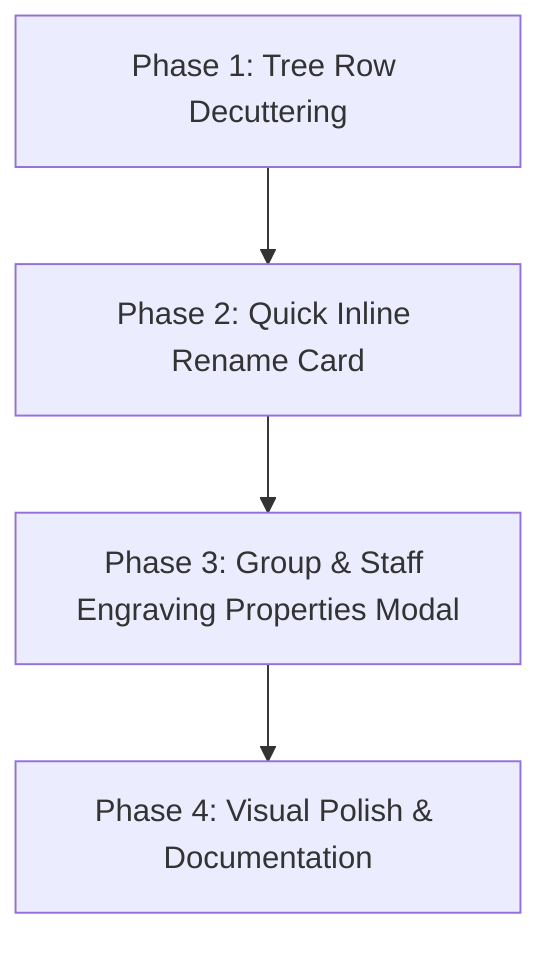

# UX & Architectural Research: Maturing the Labeling System & System Hierarchy Panel

**Author:** Antigravity (Google DeepMind Advanced Agentic Coding)  
**Date:** October 2026  
**Status:** Proposal & Architectural Blueprint  
**Target:** `sarvmd_ui` — `SystemHierarchyPanel`, `StaffGroupWidget`, `StaffItemWidget`, `QuickLabelingCard`

---

## 1. Executive Summary & Root-Cause Diagnosis

The **System Hierarchy Panel** and its associated **Labeling System UI** serve as the architectural control center of SarvMD. They bridge the abstract hierarchical score tree (`SystemLayout`, `StaffNodeGroup`, `StaffDefinition`) with physical page engraving geometry (connectors, brackets, Model B/C placements, Gouldian indents, and typography).

However, the current implementation suffers from severe spatial compression and cognitive overload:
1. **The Physical Geometry Paradox:** The panel is hosted inside a docked desktop sidebar (default width 320px) or mobile/tablet drawer (280–320px). Hierarchical tree nesting applies progressive indentation (up to 3 levels deep per Gould/MOLA), reducing the inner content width of nested cards to **210px–250px**.
2. **The "Everything Everywhere" Anti-Pattern:** A single 240px inline card currently attempts to host:
   - Reordering drag targets and feedback.
   - Multi-selection checkboxes and count badges.
   - 4 to 5 icon buttons per item row (`Edit`, `Visibility`, `Config Dialog`, `Delete`).
   - 4 persistent badges per staff (`Clef`, `5 lines`, `Anchor line`, `Label preview`).
   - An inline label editor containing 4 `SegmentedButton` controls, 4 multi-line musicological explanatory banners, a Gould non-redundancy auto-numbering banner, a typography toolbar, and keyboard shortcut guides.
3. **The Explanatory Wall-of-Text Paradox:** To make complex engraving rules (Model B centered numbering, Model C section headers above staves, Continental flush vs. Anglo-American enclosed connectors, header lifecycle) understandable, the UI embeds lengthy descriptive paragraphs into the form. In a 240px column, these banners consume 600–900px of vertical height, pushing the score hierarchy completely off-screen and creating visual cacophony.

---

## 2. Industry Benchmark & Precedents

How do premier music notation and creative design tools manage deep hierarchical properties in narrow sidebars?

| Application | Hierarchy / Outliner Tree | Property Inspection & Deep Configuration |
| :--- | :--- | :--- |
| **Steinberg Dorico** | **Setup Mode Tree:** Ultra-clean. Displays only instrument name, drag handle, and solo/mute dot. Zero button clutter. | **Engraving Options & Properties Panel:** Completely decoupled from the tree. Opened in dedicated dialogs or a bottom drawer with visual diagrams. |
| **Avid Sibelius** | **Add/Remove Instruments Dialog:** Clean multi-tier list. | **Inspector Panel:** Separate floating or docked pane showing properties for the currently selected item. |
| **Figma / Penpot** | **Layers Tree:** Icon (Frame/Vector/Text) + Name + Eye (hover) + Lock (hover). Fast inline rename (double-click). | **Design Inspector:** Full-width dedicated sidebar displaying typography, auto-layout, and fills for the active selection. |
| **VS Code** | **Explorer Tree:** File icon + filename + git badge. Rename is a clean 28px single text box. | **Settings / Configuration:** Searchable tabbed editor with progressive disclosure. |

**Key Takeaway:** No industry-leading tool attempts to cram a 10-field, multi-paragraph engraving options dialog *inside* a nested tree row in an already narrow sidebar. The tree must remain **scannable and structural**; deep configuration belongs in a **focused, un-cramped surface**.

---

## 3. The 4-Pillar Architectural Proposal

### Pillar 1: The Lean, High-Scannability Tree Row

To give instrument names and group titles room to breathe, we must strip away visual noise and button proliferation:

1. **Eliminate Default-State Noise:**
   - Standard 5-line classical staves with default anchor lines should **not** display `[5 lines]` or `[Anchor 2]` badges.
   - Only show badges for **anomalous or specialized staves**: e.g., `[TAB]`, `[1 Line Perc.]`, `[6 Lines]`, or `[Custom Style]`.
2. **Collapse 5 Icon Buttons into 1 Action Anchor:**
   - Current staff row buttons: `[Edit]` `[Visibility]` `[Configure Dialog]` `[Delete]` (occupying ~128px out of 240px).
   - **Proposed:**
     - **Persistent Toggle:** `Visibility` (eye icon) — critical for quick score arrangement.
     - **Contextual Menu (`...` kebab or Right-Click):** Houses `Configure Staff Dialog`, `Duplicate Staff`, and `Remove Staff`.
     - **Double-Click or Click Name:** Instantly enters quick rename mode.
   - **Result:** Instrument names (`Violoncello`, `Bass Clarinet in B♭`) gain **+80px of horizontal room**, eliminating aggressive text truncation.

---

### Pillar 2: De-Cramping the Editing Experience (The Three UX Paradigms)

We analyze three alternative paradigms for editing names and engraving rules:

```
┌─────────────────────────────────────────────────────────────────────────────┐
│ PARADIGM A: Dual-Tier Progressive Disclosure (RECOMMENDED)                  │
│                                                                             │
│ 1. Quick Inline Rename (90% Action):                                        │
│    Double-click staff/group -> Sleek 48px inline box:                       │
│    [ Full Name: Horn in F      ] [ Abbrev: Hn. ] [✓]                        │
│                                                                             │
│ 2. Deep Engraving Options (10% Action):                                     │
│    Tap "Engraving Setup..." -> Spacious Adaptive Modal                      │
│    (Tabs: Placement & Model C | Numbering & Model B | Typography)          │
└─────────────────────────────────────────────────────────────────────────────┘

┌─────────────────────────────────────────────────────────────────────────────┐
│ PARADIGM B: Master-Detail / Tree-Inspector Split                            │
│                                                                             │
│ [ Tree View (Top 60%)              ]                                        │
│   ├── Woodwinds                     ]                                        │
│   │   └── Flute 1  <-- Selected     ]                                        │
│ ────────────────────────────────────                                        │
│ [ Selected Item Inspector (Bottom) ] (Full panel width, no tree indents)    │
│   [ Name & Abbrev ] [ Placement ] [ Numbering ]                             │
└─────────────────────────────────────────────────────────────────────────────┘

┌─────────────────────────────────────────────────────────────────────────────┐
│ PARADIGM C: Compact Tabbed Inline Card with Visual Pill Badges              │
│                                                                             │
│ (Inline replacement inside tree, but radically simplified)                  │
│ - Tabs: [ Identity ]  [ Engraving Options ]                                 │
│ - Banners replaced with visual icons and tooltips.                          │
└─────────────────────────────────────────────────────────────────────────────┘
```

#### Recommendation: **Paradigm A (Dual-Tier Progressive Disclosure)**
- **Why?**
  1. **90% of user interactions** in the hierarchy panel are quick renaming ("Violin 1" -> "Violin I", adjusting abbreviations) or reordering. A lightweight 48px inline card is lightning-fast and never pushes the rest of the score tree out of view.
  2. **The 10% deep engraving decisions** (Model B numbering, Model C section headers above staves, Continental vs. Anglo-American connector placement) are architectural score-level settings made once per project. They deserve the full visual canvas of `showSarvAdaptiveModal` (already built and tested across desktop and mobile in Todo #15) with rich comparison diagrams, side-by-side previews, and zero horizontal squeeze.

---

### Pillar 3: Replacing "Wall-of-Text" with Visual Idioms & Micro-Diagrams

In both the Quick Inline Editor and the Engraving Options Modal, replace long paragraphs with intuitive visual music notation glyphs:

#### 1. Group Label Placement (Margin vs. Above Staff)
- **Current:** Text segmented button + 4-line amber warning card about Model C saving 25–35mm.
- **Proposed:** Visual choice tiles with micro-renderings:
  - **Margin (Left):** `[ ⊣ Woodwinds ]` (Outer margin alignment).
  - **Above Staff (Model C):** `[ ⊤ WOODWINDS ]` (Header over barline).
  - Information icon `ⓘ` tooltip provides the detailed engraving context on demand without cluttering the screen.

#### 2. Descriptor Placement (Anglo-American vs. Continental)
- **Current:** 4-line text box citing Bärenreiter and Gould.
- **Proposed:** Visual bracket tokens:
  - `[ [ Fl. 1 ]` **Enclosed** (Anglo-American: bracket holds descriptors).
  - `[ Fl. 1 ⊏ ]` **Outside** (Continental: connector flush against barline).

#### 3. Child Staff Numbering (Model B)
- **Current:** Segmented button + explanation card.
- **Proposed:**
  - Clear toggle pills: `[ Off ]` `[ 1, 2, 3 ]` `[ I, II, III ]`.
  - Live preview chip below: `Preview: Flutes [ 1 / 2` updated in real time.

#### 4. Gould Non-Redundancy Assistant
- Convert the large rectangular card into a single compact action button:
  - `[ ✨ Renumber 1..N (Gould Style) ]`
  - Shows an amber confirmation chip when active.

---

### Pillar 4: Typography Cluster Responsive Consolidation

In `LabelTypographyCluster`:
- Keep the current responsive `Wrap` layout that prevents overflows.
- Consolidate font family, bold, and italic into a sleek segmented micro-toolbar:
  - `[ Serif | Sans ]`  `[ B ]`  `[ I ]`  `[ − 11 pt + ]`
- Total height: **32px**. Total width needed: **~210px**, fitting easily into any nested tree depth.

---

## 4. Standard Framework for Eliminating RenderFlex Overflows in Narrow Hierarchy Panels

In Flutter desktop and mobile engineering, narrow sidebars (220px–320px) present continuous overflow hazards when nesting layouts. Rather than ad-hoc padding tweaks, SarvMD adopts a **standardized 6-point layout discipline**:

### 4.1 Strict Row Text Sizing: The `Expanded` + `TextOverflow.ellipsis` Law
- **Anti-pattern:** Placing a `Text` widget directly inside a `Row` alongside icons, badges, or buttons. If the text is slightly long (e.g. *Bass Clarinet in B♭*), the row explodes with `RenderFlex overflowed by X pixels`.
- **Standard:** Every label inside a row MUST be enclosed in `Expanded` (or `Flexible`) with:
  ```dart
  Expanded(
    child: Text(
      labelText,
      maxLines: 1,
      overflow: TextOverflow.ellipsis,
    ),
  )
  ```
- Tooltips (`Tooltip(message: fullText, child: ...)`) are paired with truncated text so the full name remains accessible on hover/long-press.

### 4.2 Multi-Item Clustering via `Wrap` Instead of Rigid `Row`
- **Anti-pattern:** `Row(children: [ClefBadge, LinesBadge, AnchorBadge, CustomChip])`.
- **Standard:** Whenever more than 2 badges or controls sit together, consume `Wrap`:
  ```dart
  Wrap(
    spacing: 4,
    runSpacing: 4,
    crossAxisAlignment: WrapCrossAlignment.center,
    children: [ ...badges ],
  )
  ```
- If the panel narrows or tree nesting increases depth, the badges gracefully wrap onto a second line without throwing any layout errors.

### 4.3 Adaptive Row-to-Column Folding via `LayoutBuilder`
- **Standard:** In inline cards (such as `QuickLabelingCard`), evaluate local parent constraints:
  ```dart
  LayoutBuilder(
    builder: (context, constraints) {
      final isCompact = constraints.maxWidth < 250;
      if (isCompact) {
        return Column(
          crossAxisAlignment: CrossAxisAlignment.stretch,
          children: [ nameField, const SizedBox(height: 8), abbrevField ],
        );
      }
      return Row(
        children: [
          Expanded(flex: 3, child: nameField),
          const SizedBox(width: 8),
          Expanded(flex: 2, child: abbrevField),
        ],
      );
    },
  )
  ```

### 4.4 Action Compaction: Fixed Overhead via `PopupMenuButton`
- **Standard:** Instead of rendering $N$ buttons horizontally (`4 * 32px = 128px`), collapse non-primary actions into a single `PopupMenuButton` (`1 * 28px = 28px`).
- This guarantees a **fixed horizontal footprint** of ~36px for row actions regardless of how many tools are available (Configure, Duplicate, Move Up, Move Down, Delete).

### 4.5 Horizontal Action Rail Fallback
- For Contextual Action Bars (CAB) and batch command strips that feature multiple actions simultaneously, always wrap the action cluster in a non-scrolling or horizontally scrolling viewport:
  ```dart
  SingleChildScrollView(
    scrollDirection: Axis.horizontal,
    physics: const ClampingScrollPhysics(),
    child: Row(children: [ ...actions ]),
  )
  ```

### 4.6 Architectural Evacuation: Dialogs for Multi-Column Controls
- Controls like 3-segment buttons (`[ 1st System | Top of Page | All Systems ]`), explanatory diagrams, and multi-field spacing inputs are **architecturally banned** from indented tree rows under 260px.
- They are evacuated to `showSarvAdaptiveModal` which enforces minimum width bounds (`constraints: BoxConstraints(minWidth: 420, maxWidth: 640)`) with vertical scroll physics, completely neutralizing narrow overflow vectors.

---

## 5. Implementation Phasing Strategy



### Phase 1: Tree Row Decluttering & Scannability
- Update `StaffItemWidget` and `StaffGroupWidget`.
- Hide redundant default badges (`5 lines`, `Anchor 2`).
- Replace 4 icon buttons with `Visibility` toggle + `...` menu button (`PopupMenuButton` with Edit, Config, Duplicate, Delete).
- Allow double-clicking on the label to immediately trigger rename.

### Phase 2: Lightweight Quick Inline Rename
- Simplify `QuickLabelingCard` for inline mode:
  - Contains **only**: Name field, Abbreviation field with auto-suggest chip, Save, Cancel, and an "Engraving Options..." button.
  - Height reduced from ~450px to ~85px.
  - Zero cognitive noise during quick renaming.

### Phase 3: Dedicated Engraving Properties Modal
- Create `GroupEngravingConfigDialog` and integrate into `showSarvAdaptiveModal`.
- Host Model B numbering, Model C placement, Header lifecycle, and Descriptor placement with spacious visual diagrams and live preview chips.
- Add an entrypoint from the `...` menu and from the Quick Rename card.

### Phase 4: Verification & Test Coverage
- Update existing widget tests in `system_hierarchy_panel_test.dart`.
- Verify zero `RenderFlex` overflows on screen widths down to 220px.
- Verify 100% test pass and 0 static analysis issues.

---

## 5. Conclusion & Expected Impact

By decoupling **fast structural tree navigation** from **deep score engraving properties**:
1. **Vertical bloat is reduced by >75%**: Opening an edit mode no longer distorts the tree or pushes staves off-screen.
2. **Horizontal room for names increases by >50%**: Instrument names are easily readable without aggressive truncation.
3. **Cognitive clarity is restored**: Explanations become progressive tooltips rather than mandatory reading material on every click.
4. **Professional alignment**: The architecture matches the ergonomics of Dorico, Sibelius, and Figma while honoring Gould and MOLA engraving standards.
