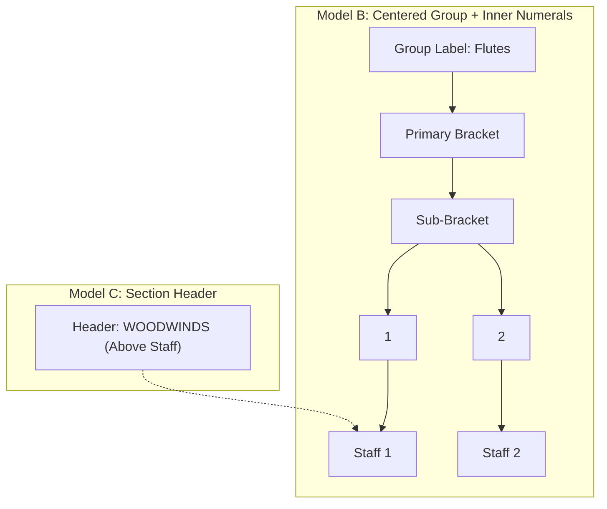

# Implementation Plan: Advanced Sub-Group Labeling Modes (Model B & Model C)

---

## 1. Architectural Overview

Based on our comparative engraving research across master publisher editions (Bärenreiter Urtext, Breitkopf & Härtel, Boosey & Hawkes, Durand, and Gould's *Behind Bars*), this milestone introduces two complementary engraving modes that eliminate horizontal margin waste on nested orchestral scores:

1. **Model B: Centered Group Label + Inner Numerals (`GroupNumberingStyle`)**:
   - Centered group title (e.g. *Flutes*, *Trombones*) positioned to the left of the bracket cluster.
   - Child staves automatically labeled with compact inner numerals: Arabic (`1, 2, 3`) or Roman (`I, II, III`).
   - Keeps inner descriptor width minimal (~2.5mm–3.5mm), pulling sub-brackets flush to the staves.

2. **Model C: Section Headers Above Staves (`GroupLabelPlacement.aboveStaff`)**:
   - Family/choir titles (e.g. **WOODWINDS**, **BRASS**, **STRINGS**) rendered as bold headers above the first staff of the group.
   - Completely removes the family name from the left horizontal margin, saving **25mm to 35mm** of printable notation width per system.



---

## 2. Phase Breakdown

### Phase 1: Core Domain Models (`packages/sarvmd_core/lib/src/config.dart`)
1. Define `GroupLabelPlacement` enum:
   ```dart
   enum GroupLabelPlacement {
     margin,     // Classical left-margin placement outside connector
     aboveStaff, // Section header above the topmost staff of the group
   }
   ```
2. Define `GroupNumberingStyle` enum:
   ```dart
   enum GroupNumberingStyle {
     none,   // Preserve manual staff names as-is
     arabic, // Auto-number inner staves as '1', '2', '3'...
     roman,  // Auto-number inner staves as 'I', 'II', 'III'...
   }
   ```
3. Extend `StaffNodeGroup`:
   - Add `final GroupLabelPlacement labelPlacement;` (default: `.margin`)
   - Add `final GroupNumberingStyle numberingStyle;` (default: `.none`)
   - Update `copyWith`, `toJson`, `fromJson`, `operator ==`, `hashCode`.

---

### Phase 2: Layout Engine (`packages/sarvmd_core/lib/src/layout.dart`)
1. Extend `GroupPlacement`:
   - Add `labelPlacement` and `numberingStyle`.
2. Update `computeLayout`:
   - **Inner Staff Numbering**: If group has `numberingStyle == .arabic` or `.roman`, automatically generate child staff labels (`1, 2` or `I, II`) unless overridden, and compute local inner descriptor widths accordingly.
   - **Above-Staff Header Handling**: If `group.labelPlacement == .aboveStaff`, set `groupLabelWidthMm = 0.0` for horizontal indent calculations (does not consume horizontal margin space).
   - **Headroom Allocation**: Ensure clearance above `staves[group.startStaffIdx]` when `labelPlacement == .aboveStaff`.

---

### Phase 3: Cross-Emitter Visual Parity (All 4 Emitters)
Implement `labelPlacement == .aboveStaff` rendering across all vector targets:
1. **Interactive Canvas (`preview_canvas.dart`)**:
   - Render bold section header text above `staves[group.startStaffIdx]` with letter spacing.
2. **Direct Vector PDF (`pdf_emitter.dart`)**:
   - Draw uppercase bold header text above top staff of group.
3. **Vector SVG (`svg_emitter.dart`)**:
   - Emit `<text>` element with `font-weight="bold"` above group.
4. **LaTeX Emitter (`emitter.dart`)**:
   - Emit `\put(x, y){\makebox(0,0)[l]{\textbf{...}}}` above group.

---

### Phase 4: UI Integration in `sarvmd_ui`
1. Update `_QuickLabelingCard` and group settings in `advanced_builder_panel.dart`:
   - Add segmented / dropdown controls for:
     - **Label Placement**: *Margin (Left)* vs. *Above Staff (Header)*
     - **Inner Numbering**: *None*, *Arabic (1, 2)*, *Roman (I, II)*
2. Provide commands in `DocumentCubit` (`updateGroupDetails`) supporting `labelPlacement` and `numberingStyle`.

---

### Phase 5: Verification & Quality Assurance
1. **Core Unit Tests**:
   - Test `GroupLabelPlacement` and `GroupNumberingStyle` JSON serialization and tree updates.
   - Test `computeLayout` verifying that `aboveStaff` headers do not bloat `leftIndentMm`.
   - Test Roman and Arabic auto-numbering.
2. **QA Gallery Generation**:
   - Regenerate the 32-scenario QA gallery including Model B & Model C scenarios.
3. **UI Tests**:
   - Run `flutter test --no-pub` across the full test suite.
