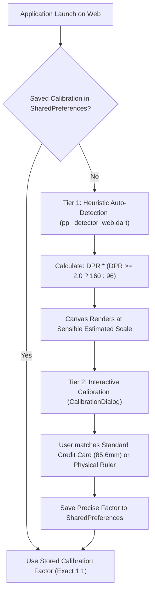

# Web Screen DPI & Physical Dimension Detection: Technical Research

---

## 1. Executive Summary

A core goal of SarvMD's canvas is **True-to-Life 1:1 Scale** — ensuring that a 7.0mm stave or a 20mm margin rendered on screen measures *exactly* 7.0mm or 20mm when held against a physical ruler. On native desktop operating systems (Linux via `xrandr`, macOS via `system_profiler`, Windows via WMI `WmiMonitorBasicDisplayParams`, and Android/iOS via display metrics), the OS directly queries the display's EDID/DisplayID data to extract physical millimeter dimensions.

On the Web, however, **there is currently no standard web API that allows JavaScript or Flutter Web to directly query physical screen DPI or monitor millimeters**.

This document details:
1. The technical and architectural reasons behind this web platform constraint.
2. The failure modes of common web tricks (such as the "1-inch `<div>`").
3. What information *can* be extracted in the browser.
4. How SarvMD's hybrid architecture solves this gracefully and matches industry gold standards.

---

## 2. Technical Breakdown: Why the Web Hides Physical DPI

### 2.1 The W3C "CSS Pixel" Standard (CSS Values and Units Level 3/4)
In early web history, physical CSS units (`in`, `cm`, `mm`, `pt`, `pc`) were intended to map to real-world measurements. However, because early operating systems and CRT monitors reported incorrect or missing physical DPI, web pages looked wildly inconsistent across devices.

To fix this, the **W3C CSS Working Group intentionally decoupled physical CSS units from the physical world**. By specification:
$$\text{1 CSS inch} \equiv 96\text{ CSS pixels}$$
$$\text{1 CSS cm} = \frac{96}{2.54}\text{ CSS pixels} \approx 37.795\text{ CSS pixels}$$
$$\text{1 CSS mm} = \frac{9.6}{2.54}\text{ CSS pixels} \approx 3.7795\text{ CSS pixels}$$

#### Why the "1-inch DOM element" trick fails:
If a web application creates an off-screen `<div>` with `width: 1in;` and queries its width via `getBoundingClientRect().width` or `offsetWidth`, the browser will *always* return exactly **96.0** (or $96 \times \text{devicePixelRatio}$). The browser does not measure the screen glass; it simply applies the W3C mathematical identity.

### 2.2 Device Pixel Ratio (`window.devicePixelRatio`)
The `window.devicePixelRatio` (DPR) property describes how many physical hardware pixels back a single CSS logical pixel.
- A standard 24" 1080p desktop monitor has a DPR of `1.0`.
- A 13" 1080p laptop display might use an OS scaling of 125% or 150%, reporting DPR `1.25` or `1.5`.
- A 14" MacBook Pro Liquid Retina display reports DPR `2.0`.
- High-end mobile phones report DPR `2.625`, `3.0`, or `3.5`.

Crucially, **DPR does not indicate physical screen size**.
- A **24-inch 1080p desktop monitor** has ~92 physical PPI, with DPR = 1.0.
- A **55-inch 1080p television** has ~40 physical PPI, with DPR = 1.0.
- An **iPad** with DPR = 2.0 has 264 physical PPI.
- A **MacBook** with DPR = 2.0 has 227 physical PPI.

Because both monitors report identical DPR and resolution to the browser, JavaScript cannot distinguish between them using DPR alone.

### 2.3 Browser Security & Anti-Fingerprinting Protections
Display hardware parameters (such as the exact monitor model, physical size in millimeters, and EDID serial numbers) are uniquely identifying. To prevent malicious trackers from generating persistent device fingerprints across browsing sessions, browser vendors (Google Chrome, Mozilla Firefox, Apple WebKit/Safari, and Tor) explicitly prohibit web pages from reading raw monitor hardware descriptors.

---

## 3. Evaluation of Modern Web APIs

| API / Mechanism | What It Provides | Does It Give Physical DPI? | Reason / Limitations |
| :--- | :--- | :--- | :--- |
| **`window.devicePixelRatio`** | Ratio of physical pixels to CSS pixels | ❌ No | Scaled relative to 96 logical DPI, not physical inches |
| **`window.screen`** (`width`, `height`, `availWidth`) | Screen resolution in CSS pixels | ❌ No | Lacks physical millimeter dimensions |
| **CSS Media Queries** (`@media (min-resolution: ...)`) | Evaluates DPI / DPPX thresholds | ❌ No | Merely evaluates $\text{DPR} \times 96\text{ dpi}$ |
| **Window Management API** (`window.getScreenDetails()`) | Multi-monitor geometry, primary flag, label | ❌ No | Provides spatial arrangement, but no physical diagonal or mm size |
| **WebXR Device API** | Physical IPD and headset display metrics | ❌ No | Only available when actively connected to an XR/VR headset |
| **User-Agent / Screen Spec Lookup Table** | Heuristic matching against known mobile devices | ⚠️ Partial | Works for fixed iOS devices (e.g. iPhone 15), but completely fails on desktop PCs with arbitrary external monitors |

---

## 4. The Recommended & Implemented Architecture in SarvMD

Because deterministic hardware extraction is mathematically impossible on the open web, industry-leading CAD, GIS, and notation software (AutoCAD Web, Onshape, Figma, and online calibration tools) rely on a **two-tier hybrid architecture**:



### Tier 1: Sensible Baseline Auto-Detection (`ppi_detector_web.dart`)
When the user opens SarvMD on the web without prior calibration, [`detectPhysicalPpi()`](file:///home/ono/Projects/sarvmd/apps/sarvmd_ui/lib/src/core/utils/ppi_detector_web.dart) executes:
```dart
Future<double?> detectPhysicalPpi() async {
  final view = WidgetsBinding.instance.platformDispatcher.implicitView ??
      (WidgetsBinding.instance.platformDispatcher.views.isNotEmpty
          ? WidgetsBinding.instance.platformDispatcher.views.first
          : null);
  if (view != null) {
    final dpr = view.devicePixelRatio;
    if (dpr > 0) {
      final baseDpi = dpr >= 2.0 ? 160.0 : 96.0;
      return dpr * baseDpi;
    }
  }
  return null;
}
```
This guarantees:
1. Standard desktop screens ($DPR \approx 1.0$) default to standard $96\text{ DPI}$.
2. High-density / Retina screens ($DPR \ge 2.0$) scale based on a $160\text{ DPI}$ baseline, avoiding microscopic rendering.

### Tier 2: Interactive Real-World Calibration (`CalibrationDialog`)
For users requiring exact physical 1:1 fidelity (such as testing whether a real-world manuscript page fits on a specific music stand or measuring stave spacing with a physical pencil and ruler), SarvMD provides the interactive [`CalibrationDialog`](file:///home/ono/Projects/sarvmd/apps/sarvmd_ui/lib/src/presentation/widgets/dialogs/calibration_dialog.dart).
- Uses standard **ISO/IEC 7810 ID-1** physical dimensions ($85.60\text{ mm} \times 53.98\text{ mm}$ — universal credit card / driver's license dimensions) or a metric ruler.
- Adjusts `ViewCubit.setCalibrationFactor` in real time with fine step controls.
- Persists the result in `SharedPreferences` under `sarvmd_calibration_factor`.

---

## 5. Conclusion & Actionable Resolution

1. **Answer to Research Question:**
   - **No standard web API exists** (or will exist in the foreseeable future) to directly query raw physical screen DPI or monitor millimeters due to W3C CSS standardization and browser anti-fingerprinting security.
2. **Current Implementation Verification:**
   - SarvMD's Web implementation in [`ppi_detector_web.dart`](file:///home/ono/Projects/sarvmd/apps/sarvmd_ui/lib/src/core/utils/ppi_detector_web.dart) already uses the optimal automated heuristic (`dpr * baseDpi`), while [`CalibrationDialog`](file:///home/ono/Projects/sarvmd/apps/sarvmd_ui/lib/src/presentation/widgets/dialogs/calibration_dialog.dart) provides the mathematically exact real-world fallback.
3. **Status:**
   - Research is complete and documented. Item 17 in `.agents/Todo` can be checked off.
