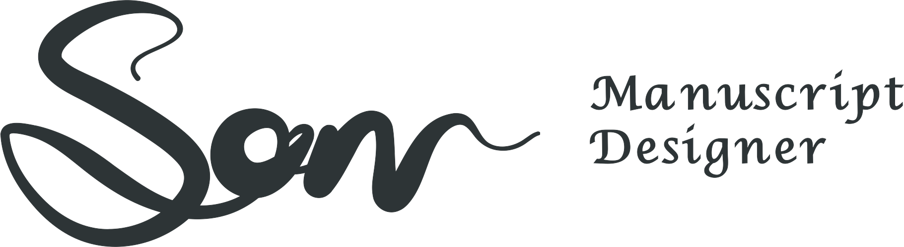

# طراح برگه‌های موسیقی سرو (Sarv Manuscript Designer)
<picture>
  <source media="(prefers-color-scheme: dark)" srcset="apps/sarvmd_ui/assets/handwriting/sarv_banner_dark.png">
  
</picture>

  <a href="README.md"><b>English</b></a> | <b>فارسی</b>

## سرو (SarvMD) چیست؟
سرو (SarvMD) یک مولد برگه نت موسیقی (کاغذ دست‌نویس) است. این ابزار با فراهم کردن محیطی فوق‌العاده منعطف، به آهنگسازان، مدرسان و نوازندگان اجازه می‌دهد برگه‌های نت دلخواه خود را طراحی کنند. سرو با سپردن کنترل تمام جزئیات صفحه به کاربر، خروجی‌هایی دقیق، خوانا و چشم‌نواز تحویل می‌دهد.

## اهداف و انگیزه‌ها
سرو با یک هدف ساده متولد شد: پایان دادن به محدودیت‌های الگوهای آماده و غیرقابل‌تغییر کاغذ نت، و هم‌زمان نجات نوازندگان از پیچیدگی‌های آزاردهنده نرم‌افزارهای نت‌نویسی سنگین.

سرو طراحی شده تا مکمل پویای فرآیند خلاقیت شما باشد؛ رابط کاربری مینیمال آن هرگز سد راهتان نمی‌شود، اما در عین حال، امکان کنترل بی‌نهایت دقیق و جزئی تمام المان‌های صفحه را به شما می‌دهد.

## سرو چطور کار می‌کند؟
سرو برای تضمین ثبات، جانمایی دقیق و رندر بی‌نقص خروجی‌ها، از یک فرآیند گام‌به‌گام و تمیز (Pipeline) عبور می‌کند:

۱. **پیکربندی (Config)**: کاربر ساختار سند (ابعاد صفحه، نوع چیدمان، اندازه خطوط حامل و تنظیمات کلیدها) را تعریف می‌کند.
۲. **موتور هندسی (Layout Engine)**: هسته اصلی برنامه موقعیت دقیق هر حامل و نقاط اتصال (Anchor Points) نمادها را به صورت پویا محاسبه می‌کند.
۳. **تولیدکننده دستورات ترسیم (Emitter)**: داده‌های چیدمان را به دستورات رندرینگ اختصاصی نگاشت می‌کند:
   - برای خروجی‌های PDF، کدهای خام لاتک (دستورات `\pdfliteral` و محیط `picture`) تولید می‌شوند.
   - برای پیش‌نمایش در محیط گرافیکی، کدهای مسیر ترسیم `CustomPainter` در فلاتر ایجاد می‌شوند.
۴. **رندر و کامپایل نهایی (Compiler/Renderer)**: 
   - در **نسخه متنی (CLI)**: ابزار `pdflatex` کدهای لاتک را به یک سند PDF برداری و مقیاس‌پذیر کامپایل می‌کند.
   - در **رابط کاربری گرافیکی (UI)**: بوم فلاتر (Flutter Canvas) با ترسیم مستقیم مسیرهای بزیه (Bézier)، پیش‌نمایشی آنی، زنده و فوق‌العاده دقیق از خروجی نهایی به نمایش می‌گذارد.

## جزئیات فنی (Technical Brief)

سرو به صورت یک **Monorepo** ماژولار با زبان **Dart** معماری شده است. این ساختار تضمین می‌کند که هسته منطقی (Core Logic) برنامه به عنوان یک **Single Source of Truth (SSoT)** بین تمام پلتفرم‌ها مشترک باشد.

### ساختار مونو-ریپو (Workspace Structure)
- **`packages/sarvmd_core`**: هسته اصلی (Foundational Engine) پروژه. این پکیج شامل دیتا مدل‌ها، محاسبات هندسی چیدمان، نحوه انتشار کدهای LaTeX و توابع کامپایل PDF است و هیچ وابستگی به فریم‌ورک‌های UI ندارد.
- **`apps/sarvmd_ui`**: ویرایشگر دسکتاپ بر پایه **Flutter** که به صورت ویژه برای Linux و Web بهینه‌سازی شده است. ویژگی‌های فنی برجسته این اپلیکیشن:
  - **الگوی Editor-Workspace**: جداسازی کامل بخش ابزارها (Tooling) از بوم اصلی طراحی (Canvas).
  - **مدیریت وضعیت (State Management)**: پیاده‌سازی مکانیزم اعلان دوگانه (Dual-Notifier) جهت تفکیک کامل وضعیت سند (`ConfigNotifier`) از تنظیمات Viewport و زوم کاربر (`ViewNotifier`).
  - **رابط کاربری Premium**: پیاده‌سازی سیستم رنگ‌آمیزی پویا بر پایه کدهای رنگی پاستلی (Pastel Seeds)، تعاملات روان و خطوط صلیبی تراز ماوس (Mouse Wings).
- **`apps/sarvmd_cli`**: یک ابزار سبک CLI برای سناریوهای headless، اتومیشن و خروجی گرفتن گروهی (Batch Generation).

### فلسفه طراحی (Design Philosophy)
- **رویکرد Desktop-First**: رابط کاربری (UI) کاملاً برای استفاده دسکتاپی بهینه‌سازی شده تا اعمال تنظیمات پیکربندی بسیار ظریف، ناوبری روان با کیبورد و ماوس، و تعامل با سیستم‌عامل به صورت روان انجام شود.
- **هسته بدون وابستگی (Zero-Dependency Core)**: کل محاسبات موتور هندسی چیدمان بر پایه دارت خالص (Pure Dart) پیاده‌سازی شده است تا سرعت بالا، پایداری بالا و عدم وابستگی به پکیج‌های ثالث را در درازمدت تضمین کند.

## مجوز و مشارکت

### پروانه کاربری (License)
کدهای سرو تحت لایسنس **Business Source License 1.1 (BUSL-1.1)** منتشر شده‌اند:
* **کاربردهای غیرتجاری**: هرگونه کپی‌برداری، شخصی‌سازی و اجرای کد برای مصارف شخصی، آموزشی یا تست کاملاً رایگان و آزاد است.
* **کاربردهای تجاری**: هرگونه بهره‌برداری تجاری در پروژه‌های کاری و عملیاتی (مانند ارائه سرویس ابری، ادغام هسته چیدمان در نرم‌افزارهای تجاری انحصاری، یا فروش مستقیم خروجی کامپایل‌شده اپلیکیشن‌ها) ممنوع بوده و نیازمند کسب اجازه کتبی از مالک اثر (**پوریا عسکری مقدم - Pooria Askari Moqaddam**) است.
* **انتقال به مدل متن‌باز (Open Source)**: این لایسنس در تاریخ **ژوئن ۲۰۳۱** به طور خودکار به مجوز منعطف و محبوب **Apache License 2.0** تغییر هویت خواهد داد.

برای مطالعه متن کامل حقوقی، لطفاً فایل [LICENSE](LICENSE) را ببینید.

### مشارکت در توسعه (Contributing)
ما با آغوش باز منتظر مشارکت‌های ارزشمند شما هستیم! برای حفظ سلامت حقوقی و حریم کد پروژه، لازم است همه مشارکت‌کنندگان کامیت‌های خود را با استفاده از **گواهی اصالت توسعه‌دهنده (DCO)** امضا و تایید کنند.

لطفاً برای راهنمای قدم‌به‌قدم نحوه امضای کامیت‌ها با فلگ (`git commit -s`)، [راهنمای مشارکت](CONTRIBUTING.md) را مطالعه کنید.
