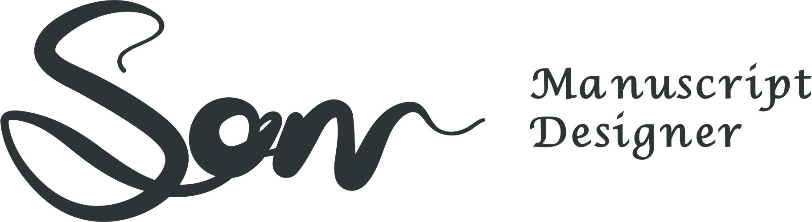

# طراح برگه نت سرو (Sarv Manuscript Designer)
<picture>
  <source media="(prefers-color-scheme: dark)" srcset="apps/sarvmd_ui/assets/handwriting/sarv_banner_dark.png">
  
</picture>

  <a href="README.md"><b>English</b></a> | <b>فارسی</b>

  

## سرو (SarvMD) چیست؟
سرو (SarvMD) ابزاری تخصصی برای طراحی و تولید برگه‌های نت موسیقی (کاغذ حامل دست‌نویس) است. این نرم‌افزار محیطی کاملاً منعطف را در اختیار آهنگسازان، مدرسان و نوازندگان قرار می‌دهد تا برگه‌های نت خود را دقیقاً مطابق با نیازهایشان چیدمان کنند. سرو با ارائه کنترل کامل روی جزئیات صفحه، خروجی‌هایی دقیق، خوانا و باکیفیت ارائه می‌دهد.

## اهداف و انگیزه‌ها
هدف از آفرینش سرو ساده بود: رهایی از محدودیت‌های الگوهای آماده و غیرقابل‌تغییر کاغذ نت، و دوری از پیچیدگی‌های غیرضروری نرم‌افزارهای سنگین نت‌نویسی.

سرو به‌گونه‌ای طراحی شده که همراه و مکمل جریان خلاقیت شما باشد؛ محیط کاربری خلوت و مینیمال آن سد راه تمرکزتان نمی‌شود، در حالی که کنترل بی‌نهایت دقیق و ظریفی روی تمام المان‌های سند در اختیارتان می‌گذارد.

## سرو چطور کار می‌کند؟
سرو برای تضمین پایداری، جانمایی دقیق و پردازش بی‌نقص خروجی‌ها، از یک خط لوله پردازشی (Pipeline) گام‌به‌گام بهره می‌برد:

۱. **پیکربندی (Configuration)**: ساختار کلی سند (ابعاد کاغذ، نوع چیدمان سیستم‌ها، اندازه خطوط حامل و کلیدها) توسط کاربر تعیین می‌شود.
۲. **موتور محاسبه هندسی (Layout Engine)**: موقعیت دقیق هر حامل و نقاط اتصال (Anchor Points) نمادها به‌صورت پویا محاسبه می‌گردد.
۳. **موتور صدور دستورات ترسیم (Emitter)**: داده‌های هندسی چیدمان به دستورات رندر اختصاصی تبدیل می‌شوند:
   - برای خروجی‌های PDF، کدهای مستقیم لاتک (دستورات `\pdfliteral` و محیط `picture`) تولید می‌شوند.
   - برای پیش‌نمایش گرافیکی، مسیرهای ترسیم `CustomPainter` فلاتر محاسبه می‌شوند.
۴. **پردازش و نمایش نهایی (Renderer/Compiler)**: 
   - **در نسخه خط فرمان (CLI)**: ابزار `pdflatex` کدهای لاتک را به سند PDF برداری (Vector) و مقیاس‌پذیر کامپایل می‌کند.
   - **در نسخه گرافیکی (UI)**: بوم فلاتر (Flutter Canvas) با ترسیم مستقیم منحنی‌های بزیه (Bézier)، پیش‌نمایشی زنده، آنی و فوق‌العاده دقیق از نتیجه ارائه می‌دهد.

## جزئیات فنی (Technical Brief)

سرو در قالب یک مخزن یکپارچه (Monorepo) ماژولار با زبان **Dart** پیاده‌سازی شده است. این معماری تضمین می‌کند منطق اصلی برنامه (Core Logic) به عنوان **مرجع یکتای داده‌ها (Single Source of Truth)** میان تمام پلتفرم‌ها مشترک باشد.

### ساختار مخزن (Workspace Structure)
- **`packages/sarvmd_core`**: هسته محاسباتی و بنیادی پروژه. این پکیج شامل مدل داده‌ها، محاسبات هندسی چیدمان، صدور کدهای LaTeX و توابع کامپایل PDF است و هیچ وابستگی به فریم‌ورک‌های UI ندارد.
- **`apps/sarvmd_ui`**: ویرایشگر گرافیکی متکی بر **Flutter** که به شکل ویژه برای وب (Web) و لینوکس (Linux) بهینه‌سازی شده است. ویژگی‌های فنی برجسته:
  - **الگوی تفکیک‌شده (Editor-Workspace)**: جداسازی کامل ابزارها و پنل‌های تنظیمات از بوم اصلی طراحی (Canvas).
  - **مدیریت وضعیت (State Management)**: پیاده‌سازی مکانیزم اعلان واکنش‌گرا بر پایه Cubit (`flutter_bloc`) جهت مدیریت روان وضعیت سند و تنظیمات نمای بوم.
  - **رابط کاربری مدرن**: سیستم تم‌های پویا، پالت‌های رنگی پاستلی، افکت‌های تصویری افق شیشه‌ای (Glassmorphic Blur Overlay)، جابه‌جایی زبانی روان و خطوط تراز ماوس (Mouse Wings).
- **`apps/sarvmd_cli`**: ابزاری سبک و سریع برای خط فرمان جهت سناریوهای اتوماسیون، استفاده بدون واسط گرافیکی (Headless) و خروجی گرفتن دسته‌جمعی (Batch Generation).

### فلسفه طراحی (Design Philosophy)
- **رویکرد Desktop & Web First**: رابط کاربری کاملاً برای استفاده روی نمایشگرهای بزرگ بهینه‌سازی شده تا تنظیمات ظریف، ناوبری روان با کیبورد و ماوس و تعامل با سیستم‌عامل به‌روانی انجام شود.
- **هسته مستقل (Zero-Dependency Core)**: تمامی محاسبات موتور هندسی چیدمان بر پایه Dart خالص (Pure Dart) پیاده‌سازی شده است تا پایداری، سرعت بالا و عدم وابستگی به کتابخانه‌های جانبی را در درازمدت تضمین کند.

## مجوز و مشارکت

### پروانه استفاده (License)
کدهای سرو تحت پروانه **Business Source License 1.1 (BUSL-1.1)** ارائه شده‌اند:
* **کاربردهای غیرتجاری**: هرگونه بهره‌برداری، شخصی‌سازی و اجرای کد برای مصارف شخصی، آموزشی یا تست کاملاً آزاد و رایگان است.
* **کاربردهای تجاری**: هرگونه استفاده تجاری در پروژه‌های کاری و عملیاتی (مانند ارائه سرویس ابری، ادغام هسته چیدمان در نرم‌افزارهای تجاری انحصاری یا فروش مستقیم) نیازمند دریافت کسب اجازه کتبی از پدیدآورنده اثر (**پوریا عسکری مقدم - Pooria Askari Moqaddam**) است.
* **انتقال به متن‌باز (Open Source)**: این پروژه در تاریخ **ژوئن ۲۰۳۱** به‌طور خودکار به پروانه متن‌باز **Apache License 2.0** منتقل خواهد شد.

برای مطالعه متن کامل حقوقی، لطفاً فایل [LICENSE](LICENSE) را ببینید.

### مشارکت در توسعه (Contributing)
از مشارکت‌های شما استقبال می‌کنیم! برای حفظ شفافیت حقوقی کد پروژه، لازم است همه مشارکت‌کنندگان کامیت‌های خود را با استفاده از **گواهی اصالت توسعه‌دهنده (DCO)** امضا کنند.

لطفاً برای راهنمای گام‌به‌گام نحوه امضای کامیت‌ها با فلگ (`git commit -s`)، [راهنمای مشارکت](CONTRIBUTING.md) را مطالعه کنید.
